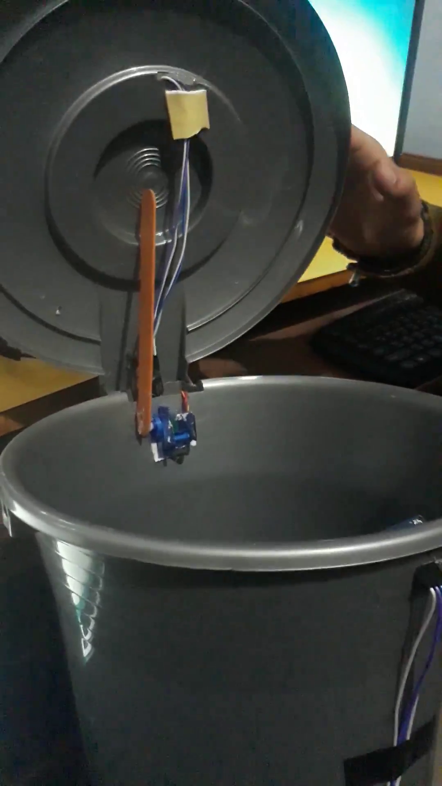

# Smart-Dustbin

Smart Dustbin is an Arduino based device created during 6 days workshop at Grammar school. It shows the current garbage level inside the dustbin using coloured leds and open it's lid when waved at it from a close distance.

## Image

   

## Components Used

1. Arduino Uno
2. Servo Motor
3. Led *3
4. Ultrasonic sensor HC-SR04 *2
5. Lipo Battery
6. Bread Board

## Working

Two ultrasonic sensors are used for hand wave and garbage level detection. Data from the garbage level sensors are used to light the 3 leds. If the dustbin is empty leds will be off, one will glow when the garbage level is 30%, 2 for 60% and 3 if the bin is full. If the wave detector sensor detects something in its range then the lid will open with the help of servo motor. After few seconds the lid will close automatically. The state information can be seen in serial monitor.

## Watch The Video

  

